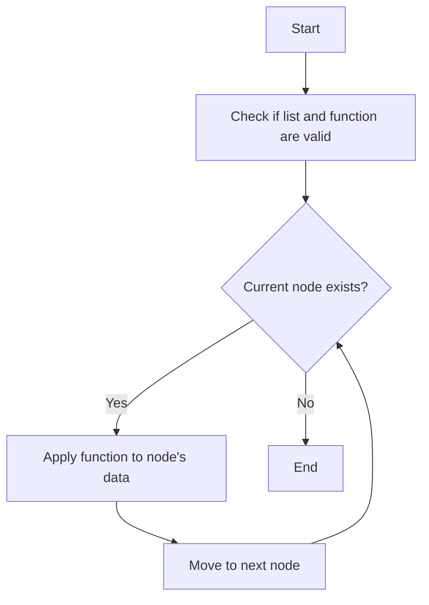
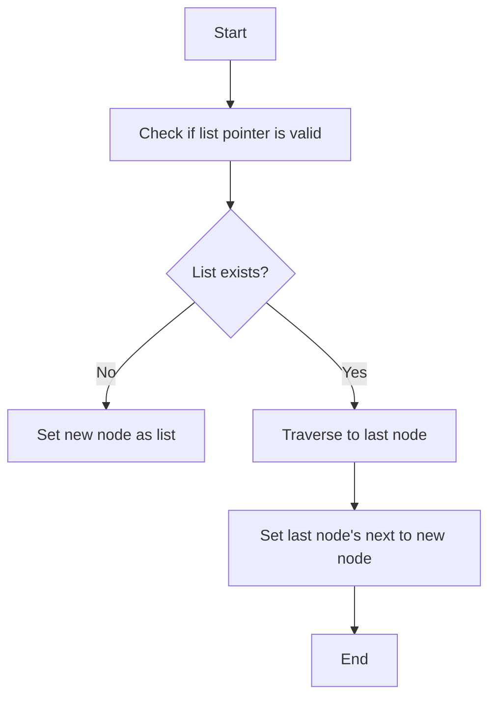
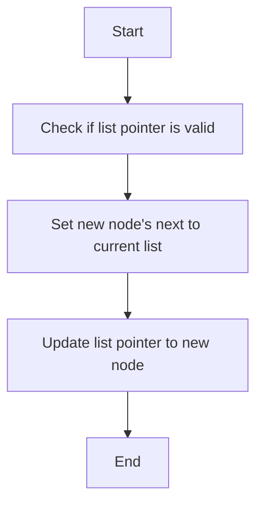
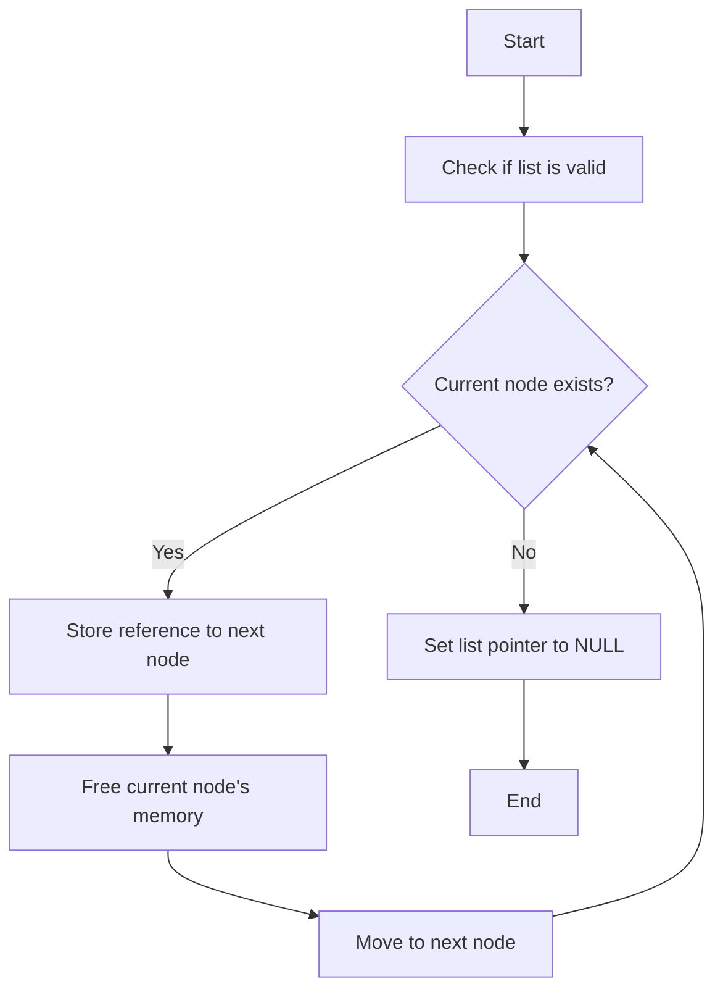
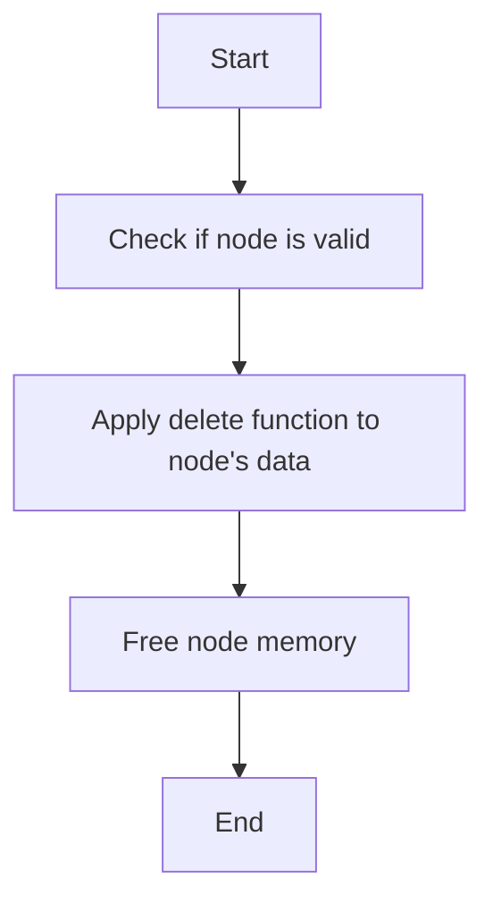
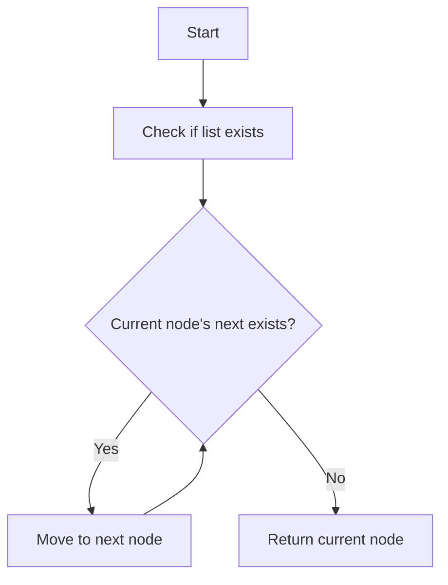
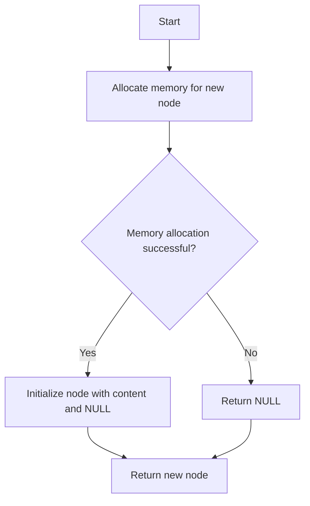
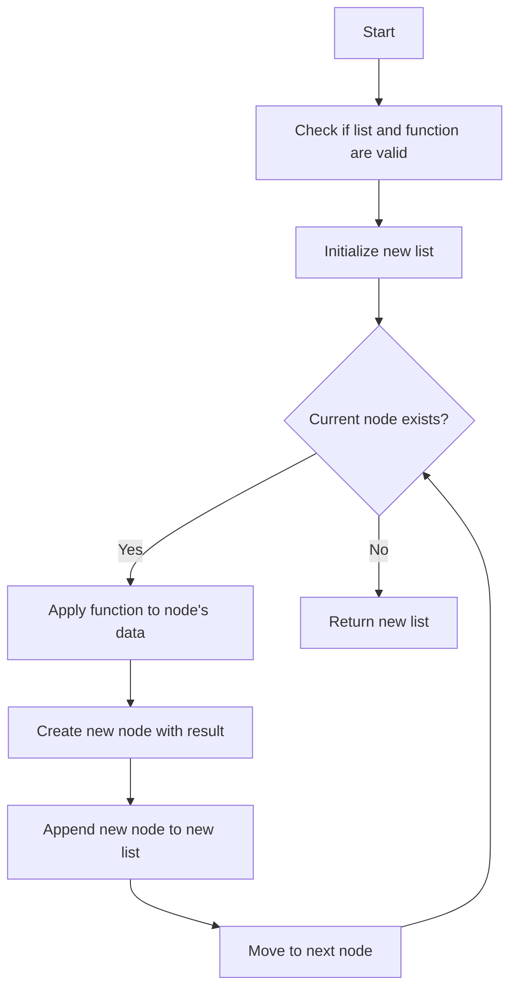

# ft_list

This repository contains the implementation of various list-based utility functions in C. These functions provide foundational operations on linked lists, useful in a variety of applications.

## Table of Contents

1. [Project Overview](#project-overview)
2. [Directory Structure](#directory-structure)
3. [How It Works](#how-it-works)
4. [Usage](#usage)
5. [Flowcharts for Functions](#flowcharts-for-functions)
6. [Contributing](#contributing)

---

## Project Overview

The **ft_list** project focuses on creating and manipulating linked lists in C. It provides functionalities for basic list operations such as creation, addition, deletion, and traversal.

### Features

- Creation and initialisation of linked lists.
- Adding elements to the head or tail of the list.
- Traversing and modifying list elements.
- Deleting elements from the list.

---

## Directory Structure

```plaintext
ft_list/
├── srcs/
│   ├── ft_list.c        # Core logic of linked list operations
│   ├── ft_list_utils.c  # Helper functions
│   └── Makefile         # Build script
├── includes/
│   └── ft_list.h        # Header file with function prototypes
└── tests/
    └── test_list.c      # Test cases for linked list functions
```

---

## How It Works

The **ft_list** functions work with a custom `t_list` structure that represents each node in the linked list. Each node contains data and a pointer to the next node in the list.

### Key Steps:

1. **Initialisation**: Create a new list or node.
2. **Adding Elements**: Append or prepend elements to the list.
3. **Traversing**: Iterate through the list to perform operations.
4. **Deletion**: Remove nodes from the list, freeing memory.

---

## Usage

1. Include `ft_list.h` in your project:
   ```c
   #include "ft_list.h"
   ```
2. Use the provided functions:
```c
void	ft_lstiter(t_list *lst, void (*f)(void*));
```
```c
void	ft_lstadd_back(t_list **lst, t_list *new);
```
```c
void	ft_lstadd_front(t_list **lst, t_list *new);
```
```c
void	ft_lstclear(t_list **lst, void (*del)(void*));
```
```c
void	ft_lstdelone(t_list *lst, void (*del)(void*));
```
```c
t_list	*ft_lstlast(t_list *lst);
```
```c
t_list	*ft_lstnew(void *content);
```
```c
t_list *ft_lstmap(t_list *lst, void *(*f)(void*), void (*del)(void *));
```c
t_list *list = ft_list_create_node(data);
```
```c
ft_list_add_front(&list, new_data);
```
```c
ft_list_traverse(list, print_function);
```
```c
ft_list_clear(&list);
```
3. Compile using the provided Makefile:
   ```bash
   make
   ```

---

## Flowcharts for Functions

### 1. `ft_lstiter`



### 2. `ft_lstadd_back`



### 3. `ft_lstadd_front`



### 4. `ft_lstclear`



### 5. `ft_lstdelone`



### 6. `ft_lstlast`



### 7. `ft_lstnew`



### 8. `ft_lstmap`



---

## Contributing

Contributions to this project are welcome. If you'd like to contribute:

1. Fork the repository.
2. Clone your forked repository:
   ```bash
   git clone https://github.com/your-username/ft_list.git
   ```
3. Create a new branch:
   ```bash
   git checkout -b feature-name
   ```
4. Commit your changes:
   ```bash
   git commit -m "Add new feature"
   ```
5. Push your changes:
   ```bash
   git push origin feature-name
   ```
6. Open a pull request on GitHub.

---

**License:** This project is licensed under the MIT License.

